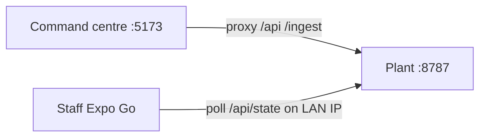
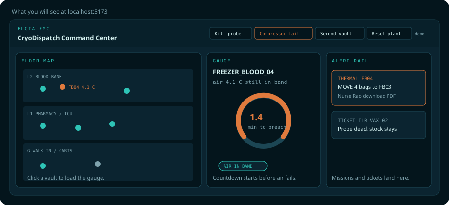

# How to run CryoDispatch

A first-time walkthrough. For the 90-second pitch, see [demo-script.md](demo-script.md). A styled version of this page is [how-to-run.html](how-to-run.html) — open it in a browser, no build.


## What you are starting

| App | What it does | Where |
| --- | --- | --- |
| **Plant** (`apps/sim`) | Simulates 24 vaults, predicts time-to-breach, picks a backup and a certified nurse, writes the custody record. | `:8787` — start this first |
| **Command centre** (`apps/web`) | Hospital wall display: floor map, gauge, alert rail, demo buttons, custody PDF. | `http://localhost:5173` |
| **Staff app** (`apps/staff`) | Nurse phone: inbox → accept MOVE → scan unit, then source, then destination. | Expo Go — optional on a laptop |

## How they talk



The browser never talks to the plant’s port directly in local dev — Vite proxies `/api` and `/ingest` to `127.0.0.1:8787`. The phone must use the laptop’s LAN IP; `127.0.0.1` is the phone itself.

## Prerequisites (once)

- Python ≥ 3.12
- Node 20+
- pnpm 10 (`corepack enable` then `corepack prepare pnpm@10.15.0 --activate` if you do not have it)
- Expo Go on a phone only if you want the staff app

From the repo root:

```bash
cd apps/sim
python3 -m venv .venv
.venv/bin/pip install -e ".[dev]"
cd ../..
pnpm install
```

## Every time — this order


| Step | Command | You know it worked when |
| --- | --- | --- |
| **1 · Plant** | `cd apps/sim && .venv/bin/python -m sim` | Rich table ticking; [http://127.0.0.1:8787/api/state](http://127.0.0.1:8787/api/state) returns JSON |
| **2 · Command centre** | `pnpm dev:web` from the repo root | Browser at [http://localhost:5173](http://localhost:5173) shows a 3-floor map, not “Connecting to plant…” |
| **3 · Staff** (optional) | `EXPO_PUBLIC_PLANT_URL=http://<LAN-IP>:8787 pnpm dev:staff` | Inbox prints that URL; Expo Go is on the same Wi-Fi |

On this Mac the LAN IP is:

```bash
ipconfig getifaddr en0
```

Three terminals. Leave the plant running while you start the others.

## What you will see

### Command centre



Header buttons drive the demo: **Kill probe**, **Compressor fail**, **Second vault**, **Reset plant**. Click a vault on the map to load the gauge. Missions and tickets land on the right rail. **Download PDF** on a completed MOVE writes the Chain of Cold Custody certificate in the browser.

### Staff app


The inbox prints the plant URL it is using — a wrong IP is visible, not silent. After **ACCEPT MOVE** the plan is locked. Scan order is **unit → source vault → destination vault**. A wrong vault is a hard reject.

## Drive it without the phone

The command-centre header is enough for a laptop-only walkthrough. From another terminal you can hit the same anomalies:

```bash
cd apps/sim
.venv/bin/python -m sim --anomaly ILR_VAX_02 lwt              # probe death → ticket only
.venv/bin/python -m sim --anomaly FREEZER_BLOOD_04 compressor  # predicted breach → MOVE
.venv/bin/python -m sim --anomaly FREEZER_BLOOD_05 compressor  # cascade
.venv/bin/python -m sim --anomaly ALL reset                   # replay
```

Without a camera, type these into the staff scan screen:

```
UNIT:BAG-ONEG-01
VAULT:FREEZER_BLOOD_04
VAULT:FREEZER_BLOOD_03
```

Printable cards: [qr-stickers.html](qr-stickers.html). Full 90-second beat: [demo-script.md](demo-script.md).

## If it does not work

| Symptom | Fix |
| --- | --- |
| Web stuck on “Connecting to plant…” | Start the plant first (`apps/sim` → `.venv/bin/python -m sim`). |
| Phone inbox empty / cannot fetch | Inbox URL is the tell. `127.0.0.1` is dead on a physical phone. Set `EXPO_PUBLIC_PLANT_URL` to `http://<LAN-IP>:8787` and stay on the same Wi-Fi. |
| Camera denied | Type the three codes above. |
| `npm` warnings or broken Expo resolve | Use **pnpm**, not npm. |
| Want a clean replay | **Reset plant** in the header, or `--anomaly ALL reset`. |

## You do not need

Supabase, MQTT, or the ESP32 firmware. Those are optional extras. The live path is the Python plant plus the two clients on one laptop (and an optional phone).
